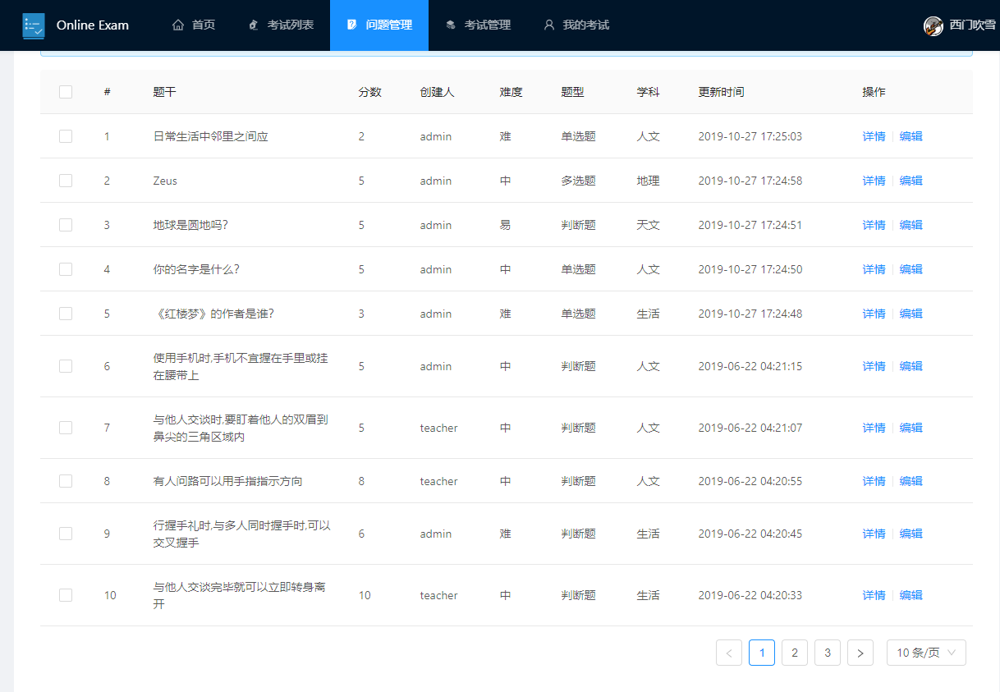
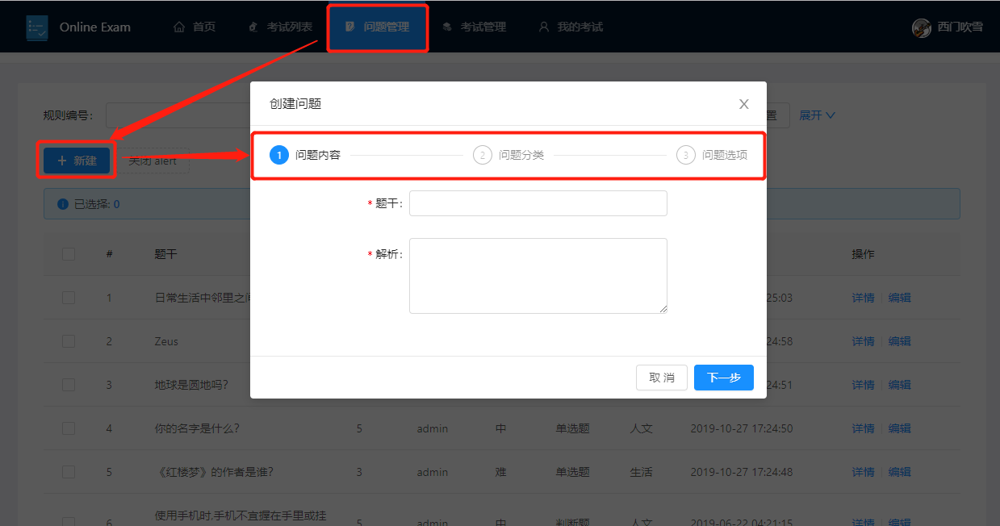
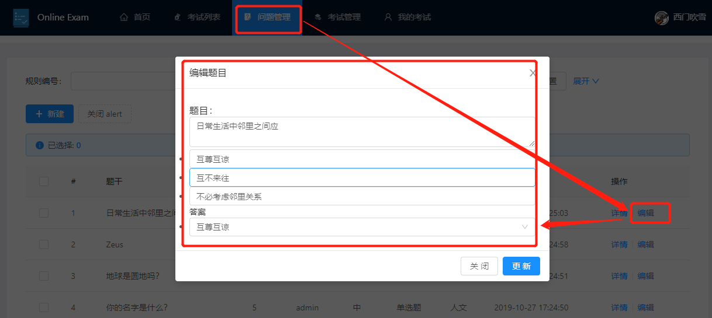
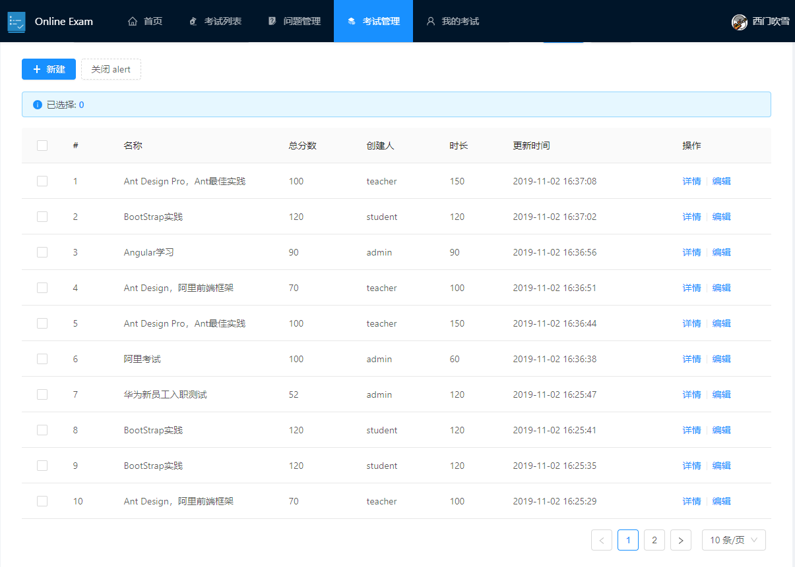
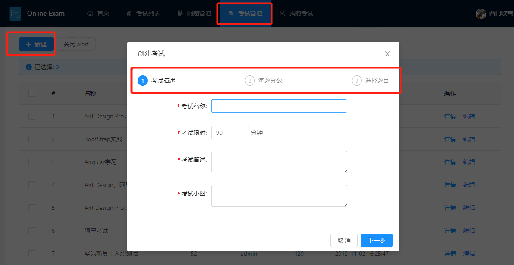
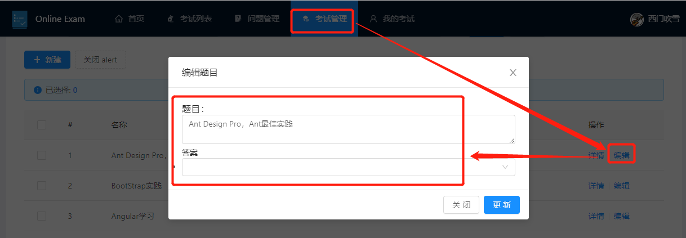
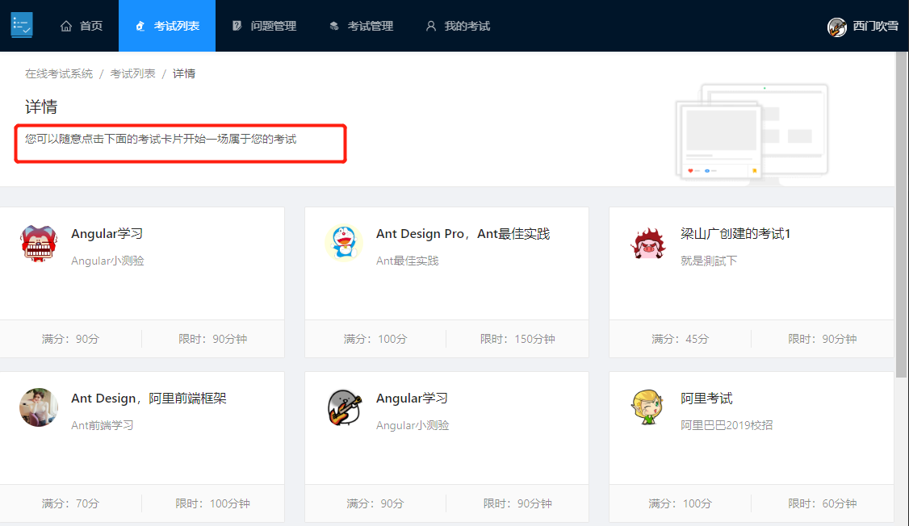
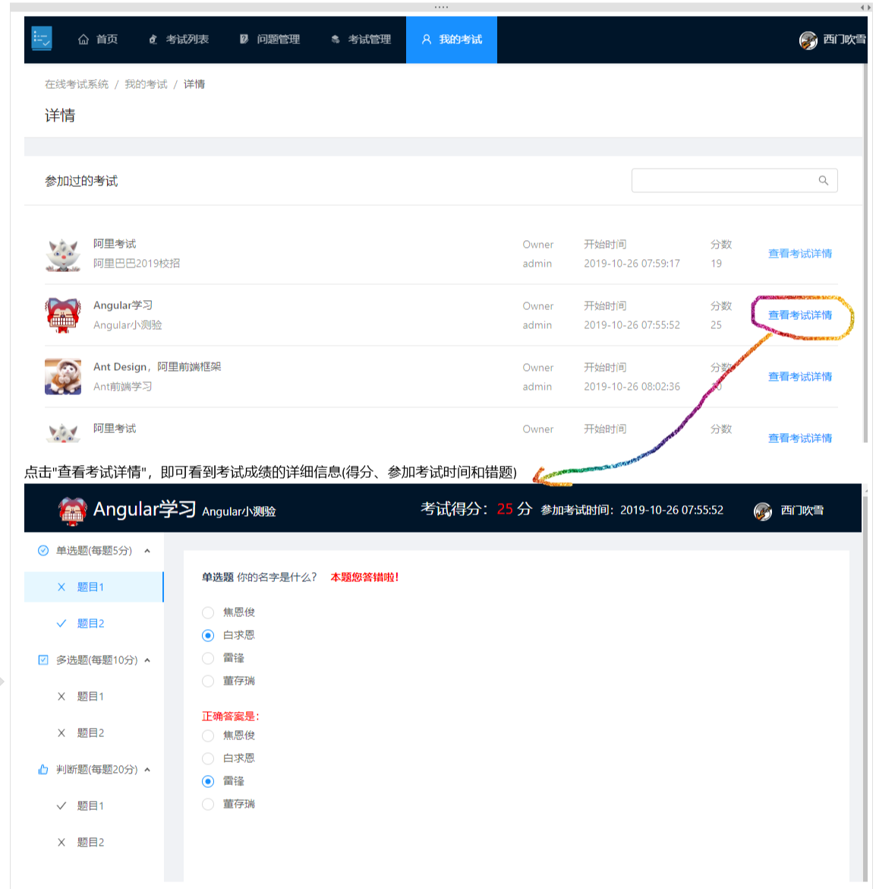

# spring-boot-online-exam

> 在线Demo预览，http://129.211.88.191 ，账户分别是admin、teacher、student，密码是admin123

### 介绍
基于springboot的在线考试系统

### 功能简介

+ 支持单选题、多选题、判断题
+ 支持学生(student)、教师(teacher)、管理员(admin)三种角色
  + 学生：参加考试和查看我的考试
  + 教师：学生的所有权限+创建/编辑题目+创建/编辑考试
  + 管理员：教师的所有权限+管理用户

### 软件架构

> 前后端分离，前段组件化，方便二次开发；后端

+ 后端采用SpringBoot+JPA++Swagger2+JWT校验,根据不同用户的权限返回给用户不同的数据
+ 后端采用Vue+AntDesign,组件化拆分，封装了很多年公共组件，方便维护和二次开发

### 功能图示

+ 1.管理题目
  + 1.1 题目列表
    > 
  + 1.2 题目创建
    > 
  + 1.3 题目更新
    > 
+ 2.考试管理
  + 2.1 考试列表
    > 
  + 2.2 考试创建
    > 
  + 2.3 考试更新(`还有点小bug，开发中`)
    > 
+ 3.我的考试
  + 3.1 参加考试
    > 在"考试列表"模块点击自己想参加的考试卡片即可
    > 
    > 
  + 3.2 考试记录查看
    > 

